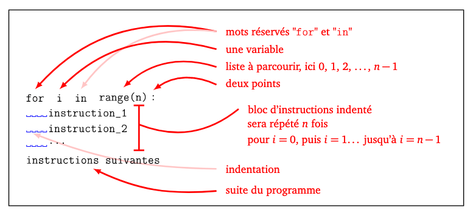
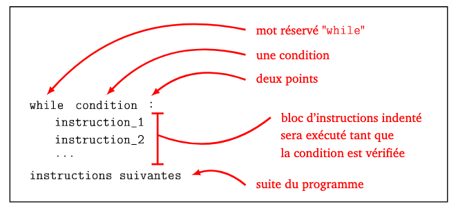
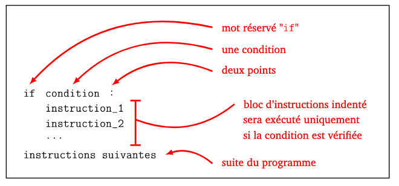
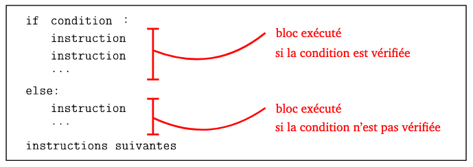

# Cookbook  python
{:.no_toc}
{:.title}


{:.lines-14}


{:.width-50.fright}


{:.page-break-before.toc-title}
# Table des matières

1. TOC
{:toc}

# Préface

Ce livre est destiné aux élèves de première année CFC en
informatique. Il a été créé afin d'avoir une référence sur 
le langage python utiliser au sein du CPNV.

Ce livre n'est en aucun cas une référence pour python. Le langage est
bien plus complexe et avancé que ce que le livre présente. 
Il permettra cependant, d'avoir une bonne connaissance de la syntaxe, et de fonction de base du langage.

# Les bases

## Compter avec python

L'interpréteur python permet de faire des calculs de manière intuitif. L'addition, la soustraction, la  multiplication 
sont simple. La division est un peu particulier. Regardons ceci de plus prêt. Voici un tableau qui représente le opération possible.

| Description                  | Notation |
|------------------------------|----------|
| Addition                     | +        |
| Soustraction                 | -        |
| Multiplication               | *        |
| Division                     | /        |
| Exponentiel                  | **       |
| Division entière             | //       |
| Reste de la division entière | %        |
|------------------------------|----------|

```python
>>> 2 + 3
5

>>> 5 - 7
-2

>>> 3 * 4
12

>>> 5 / 3
1.6666666666666667

>>> 2 ** 4
16

>>> 5 // 3
1

>>> 5 % 3
2
```

## les chaînes de caractères 

Il est aussi possible de travailler avec une chaîne de
caractères. Pour cela, il suffit de placer le texte voulut entre
simple ou double guillemet. 

```python
>>> "une simple chaine"
'une simple chaine'
```

## Tout est objet

En python, une chaine de caractère, un nombre, un tableau enfin tout
est considérer comme un objet. Il n'y a pas besoin de
spécifier le type.  Python detecte le contenu est donne un type de
manière automatique. 

Une instruction permet de connaître le type d'un objet. Cette instruction
est `type()

```python
>>> type(8)
<class 'int'>
>>> type("ma machaine")
<class 'str'>
>>>
```

## Les variable

Une Variable est un nom associé à un emplacement de la mémoire. C’est comme une boîte que
l’on identifie par une étiquette.

La instruction ` a = 3 ` signifie que j’ai une variable « a » associée à la valeur 3.

Voici un premier exemple :

```python
>>> a = 3
>>> b = 5
>>> c = a + b
>>> type(a)
<class 'int'>
>>> type(b)
<class 'int'>
>>> type(c)
<class 'int'>
>>> c
8
```

Les variables sont très pratique pour stocker des valeurs et utiliser
leur nom plus tard dans le code. Il existe plusieurs types de
variables. Les nombres entiers vu par python comme la classe `int`.
Les nombre à virgule vu par python comme la classe `float`. 
Les chaînes de caractères vu par python comme `str`raccourcis du mot
string.
Les booléens vu par python comme la classe `bool`.

## L'accès a une partie de chaîne

L'opérateur `[:]` permet de découper une chaîne de caractère. La partie
avant les ":" permet de définir le début de la nouvelle chaine. La
partie après les ":"  défini la fin.

Voici un exemple, commençons par créer une variable avec comme
contenue une chaîne de caractère. 

```python
>>> ma_chaine = "une simple chaine"
>>> ma_chaine
'une simple chaine'
```

Si nous voulons seulement la chaîne "une simple", nous pouvons
extraite celle-ci avec le code suivant :


```python
>>> ma_nouvelle_chaine = ma_chaine[:-7]
>>> ma_nouvelle_chaine
'une simple'
```

si nous voulons seulement la chaîne "simple chaîne", le code suivant
sera utiliser  :

```python
>>> ma_deuxime_chaine = ma_chaine[4:]
>>> ma_deuxime_chaine
'simple chaine'
```

Comme vous le remarque, si nous laissons la partie du début vide, la
nouvelle chaîne comme au début. Si nous laissons la deuxième partie
vide, nous allons jusqu'à la fin.

Il est aussi possible d'avoir accès à un caractère spécifique tel que
:

```python
>>> ma_chaine
'une simple chaine'
>>> ma_chaine[0]
'u'
>>> ma_chaine[1]
'n'
>>> ma_chaine[2]
'e'
```


# Les entrée/sorties

Afin de communiquer avec l'utilisateur de votre programme, il va falloir utiliser deux fonctions de base.

## L'instruction `print()`

L'instruction `print()` permet d'écrire quelque chose à l'écran. C'est une fonction que prend en paramètre le texte que l'on veut afficher.

Exemple :

```python
print("bonjour le monde")
```

Il est possible d'utiliser la commande print pour afficher la valeur d'une variable.

```python
print("La somme vaut", a+b) # Affiche la somme
print("Le produit vaut", a*b) # Affiche le produit
```

Il est possible d'utiliser directement le nom des variable dans le texte comme ceci :

```python
print(f"La somme vaut {a+b}") # Affiche la somme
```

## L'instruction input()

Il est possible de demander à l'utilisateur une valeur qu'il devra entré au clavier. La commande permettant ceci s'appelle `input()`.

`input()` met le programme en pause et attend de l’utilisateur un
 message au clavier (qu’il termine en appuyant sur la touche « Entrée
 »).
 **Attention, le message est une chaîne de caractères**. Pour transformer ce que l'utilisateur à entrer au clavier, il faut utiliser une des commandes suivantes : `int()` ou `float() en fonction du besoin.

Voici un petit programme qui demande le prénom et l’âge de l’utilisateur et affiche un message du style « Bonjour Kevin » puis « Tu es mineur/majeur » selon l’âge.

```python
prenom = input("Comment t'appelles-tu ? ")
print(f"Bonjour {prenom}")
age_chaine = input("Quel age as-tu ? ")
age = int(age_chaine)
if age >= 18:
    print("Tu es majeur !")
else:
    print("Tu es mineur !")
```

Un autre exemple qui permet de demander un nombre décimal.

```python
pourcent = input("Donnez moi un pourcentage : ")
# ici, on transforme en float
try:
    pourcent_float = float(pourcent)
except:
    print("An exception occurred")
    pourcent_float = -1
while pourcent_float == -1:
    try:
        pourcent = input("Donnez moi un pourcentage : ")
        pourcent_float = float(pourcent)
    except:
        pourcent_float = -1  

```


# Les boucles

## True, False, None

Avant de commencer les boucles, il nous faut parler de trois type de
variable particulière.

Une variable de type None est une variable non encore utilisée. Elle
ne représente rien.

Une variable de type booléen permet de stocker le resultat d'une
opération logique. Il y a deux valeurs possible `True` (vrai) ou `False`(faux).


## La boucle for

Lorsque l'on a besoin de répéter une opération plusieurs fois (le nombre
de fois est connu), nous pouvons utiliser une boucle "for" qui s'écrit
comme tel :




Si l'on veut répéter une action :


```python
>>> for x in range(0,3):
...     print(x)
...
0
1
2
```

si nous n'avons pas besoin de la variable temporaire, nous pouvons
utiliser le caractère "_".

```python
>>> for _ in range(0,3):
...     print("hello")
...
hello
hello
hello
```


Cette boucle permet aussi de parcourir une chaine de caractère.


```python
>>> ma_chaine = "une simple chaine"
>>> for c in ma_chaine:
...     print(c)
...
u
n
e

s
i
m
p
l
e

c
h
a
i
n
e
```


## La boucle while

Il existe une autre boucle qui se répète tant qu'une condition est
"vrai". Voici sa syntaxe :




La boucle while est souvent utiliser pour tester l'entrée d'un
utilisateur. Tant que l'entrée faite ne correspond pas à ce que nous
voulons on répète. Voici un exemple permettant de s'assurer que
l'utilisateur à bien entrer un entier :


```python
>>> str_nombre_entier = input("Merci de donner un entier : ")
Merci de donner un entier : b
>>> if str_nombre_entier.isdigit():
...     nombre_entier = int(str_nombre_entier)
... else:
...     nombre_entier = -1
...
>>> while nombre_entier <= 0 or nombre_entier >= 100 :
...     str_nombre_entier = input("Merci de bien vouloir enter un entier : ")
...     if str_nombre_entier.isdigit():
...             nombre_entier = int(str_nombre_entier)
...     else:
...             nombre_entier = -1
...
Merci de bien vouloir enter un entier : c
Merci de bien vouloir enter un entier : asas
Merci de bien vouloir enter un entier : 3
```


# Les conditions

## Si



Si l'on recherche à tester deux valeurs, comme par exemple si la
variable `a` et `<`que `b`, il nous faut utiliser l'opérateur `if`.

```python
>>> a = 10
>>> b = 5
>>> if a < b :
...     print("plsu petit")
...

```

Dans ce cas, rien ne se passe. Car `a` est plus grand que `b`,


## Si sinon



Pour résoudre le problème, ci dessus, nous pouvons utiliser
l'instruction `else` qui permet d'exécuter une instruction dans les
autres cas. Pour cela, reprenons l'exemple précédent et ajoutons y
`else`.


```python
>>> a = 10
>>> if a < b :
...     print("plus petit")
... else:
...     print("plus grand")
...
plus grand
```

Ici, le message `plus grand` s'affiche car `a` est bien plus grand que `b`.

